# Data Schema - Popcorn Sales Manager

Visual schema documentation for the data model using entity-relationship diagrams.

## Database Architecture

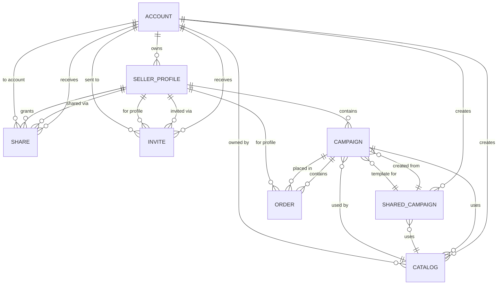

## Table Structures

### ACCOUNT
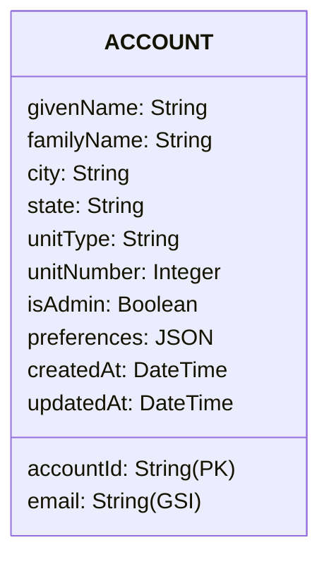

### SELLER_PROFILE
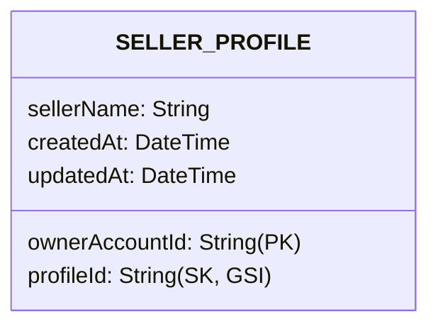

### CAMPAIGN
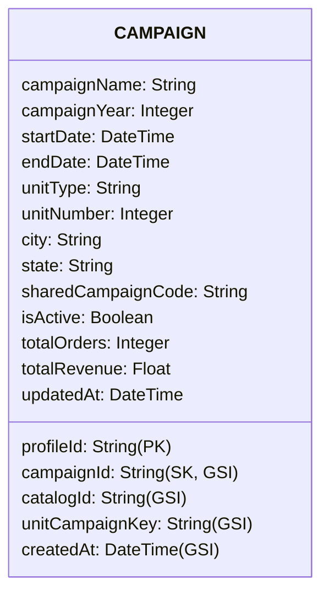

### ORDER
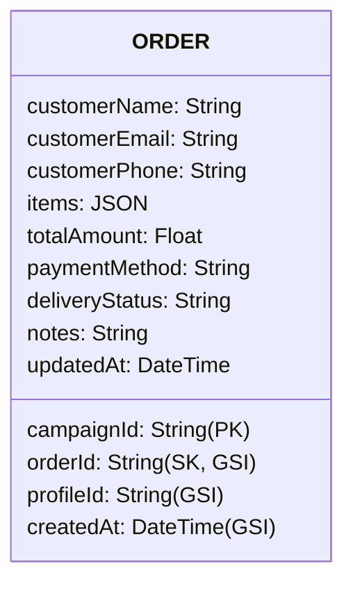

### CATALOG
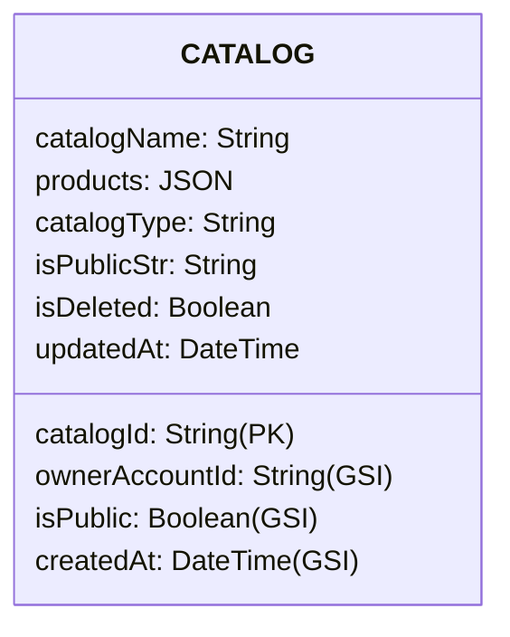

### SHARE
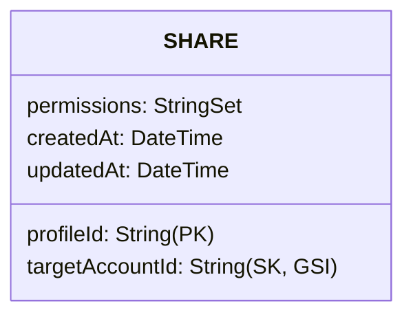

### INVITE
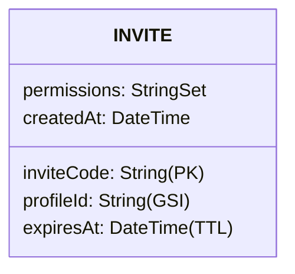

### SHARED_CAMPAIGN
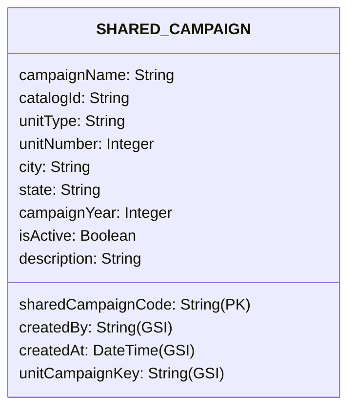

## Query Flows

### Get User's Profiles
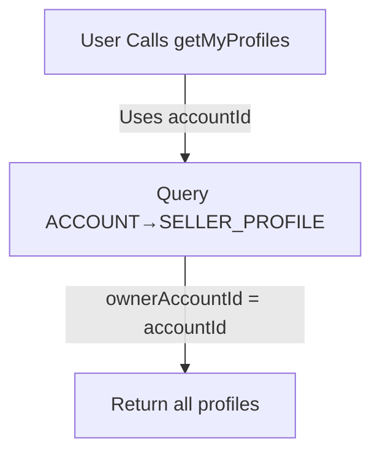

### Get Campaign with Orders
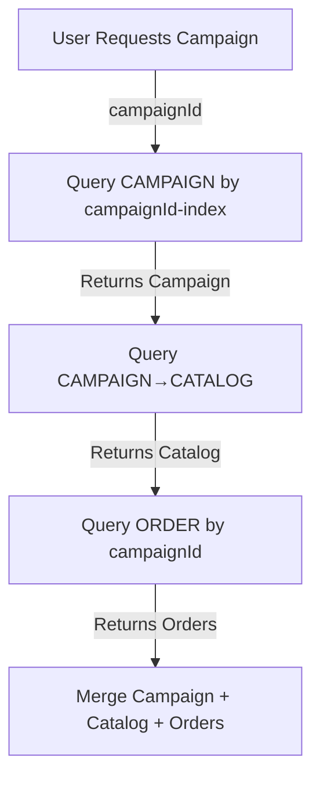

### Check Profile Access
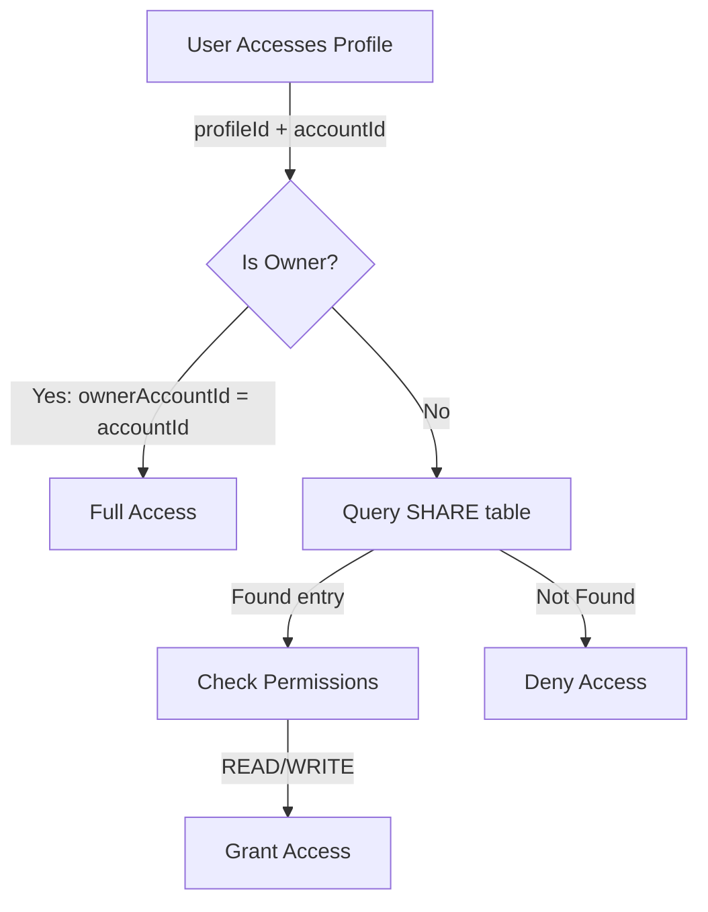

### Find Unit's Campaign
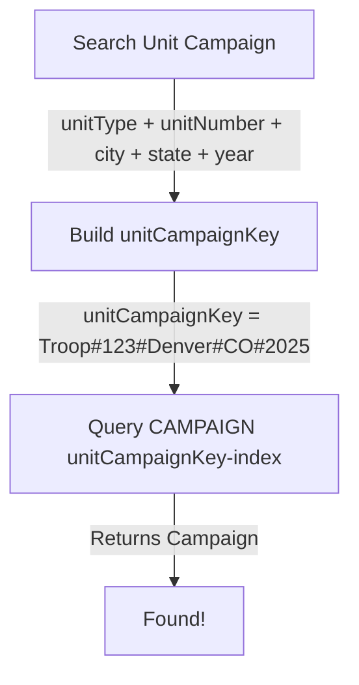

## Data Flow: Create Campaign from Shared Template

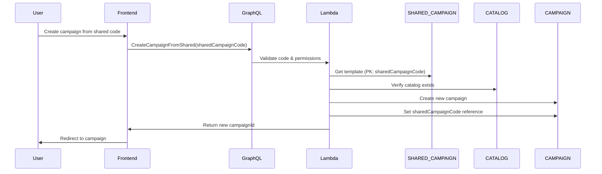

## Data Flow: Share Profile with Invite Code

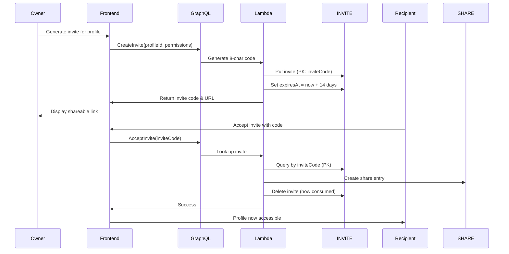

## Denormalization & Caching

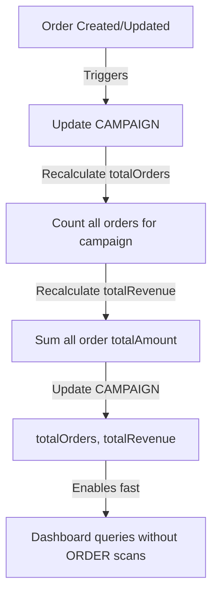

## Index Strategy

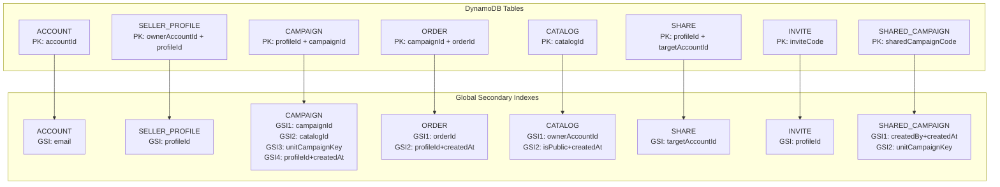

## Permission Model

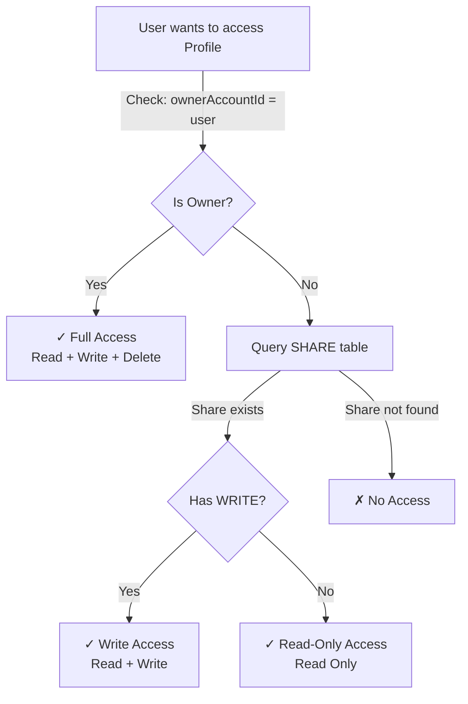

## State Management

### Active vs Inactive Campaigns
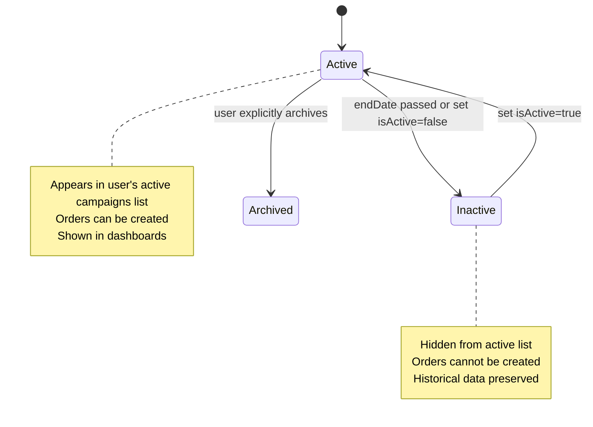

## Lifecycle: Order to Revenue

```mermaid
graph LR
    A["Customer places Order<br/>totalAmount = value"] -->|Triggers| B["Update CAMPAIGN<br/>totalOrders++<br/>totalRevenue += amount"]
    B -->|Denormalized data| C["Dashboard loads instantly<br/>No ORDER table scans"]
    A -->|Order contains| D["Line items array"]
    D -->|Product<br/>quantity"] E["Inventory tracking<br/>for reporting"]
```

## TTL: Invite Expiration

```mermaid
flowchart TD
    A["Invite created"] -->|expiresAt = now + 14 days| B["TTL enabled"]
    B -->|After 14 days| C["DynamoDB auto-deletes"]
    C -->|No manual cleanup needed| D["Cost efficient"]
    
    E["Invite accepted"] -->|Before expiration| F["User accepts invite<br/>Create SHARE entry"]
    F -->|Delete INVITE manually| G["Consumed, no TTL wait"]
```

## References

- **GraphQL Schema**: [tofu/schema/schema.graphql](../tofu/schema/schema.graphql)
- **DynamoDB Infrastructure**: [tofu/modules/dynamodb/main.tf](../tofu/modules/dynamodb/main.tf)
- **Authorization Rules**: [AGENT.md](AGENT.md#authorization-pattern)
- **Developer Guide**: [DEVELOPER_GUIDE.md](DEVELOPER_GUIDE.md)
