# Data Schema - KernelWorx

Visual schema documentation for the DynamoDB data model.

## Tables Overview

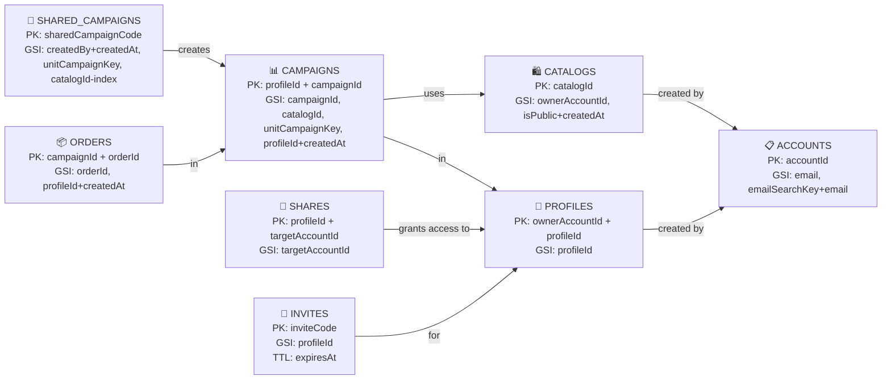
```mermaid
graph LR
    A["📋 ACCOUNTS<br/>PK: accountId<br/>GSI: email, emailSearchKey+email"] 
    B["👤 PROFILES<br/>PK: ownerAccountId + profileId<br/>GSI: profileId"]
    C["📊 CAMPAIGNS<br/>PK: profileId + campaignId<br/>GSI: campaignId, catalogId, unitCampaignKey, profileId+createdAt"]
    D["📦 ORDERS<br/>PK: campaignId + orderId<br/>GSI: orderId, profileId+createdAt"]
    E["🛍️ CATALOGS<br/>PK: catalogId<br/>GSI: ownerAccountId, isPublic+createdAt"]
    F["🔗 SHARES<br/>PK: profileId + targetAccountId<br/>GSI: targetAccountId"]
    G["🎫 INVITES<br/>PK: inviteCode<br/>GSI: profileId<br/>TTL: expiresAt"]
    H["🔄 SHARED_CAMPAIGNS<br/>PK: sharedCampaignCode<br/>GSI: createdBy+createdAt, unitCampaignKey, catalogId-index"]
    
    B -->|created by| A
    C -->|in| B
    D -->|in| C
    C -->|uses| E
    F -->|grants access to| B
    G -->|for| B
    H -->|creates| C
    E -->|created by| A
```

## Table Details

### accounts
Primary Key: `accountId` (String)
Global Secondary Indexes:
- `email-index` (email)
- `emailSearchIndex` (emailSearchKey + email)

`emailSearchIndex` is a prefix-segment index: a constant HASH key (`emailSearchKey`) plus
`email` as the RANGE key, which is what makes `begins_with(email, :prefix)` a legal Query
key condition for admin email search (`email-index` is HASH-only, so a Query key condition
there must be an equality). The index is **sparse**: an account is only searchable once it
carries `emailSearchKey`, which the Cognito account bootstrap trigger writes and
`scripts/backfill_email_search_key.py` backfills for pre-existing accounts.

| Attribute | Type | Purpose |
|-----------|------|---------|
| accountId | String | PK - Cognito user sub |
| email | String | GSI - User lookup by email; range key of emailSearchIndex |
| emailSearchKey | String | GSI - Constant HASH key (`EMAIL`) of emailSearchIndex |
| givenName | String | User's first name |
| familyName | String | User's last name |
| city | String | Location |
| state | String | Location |
| unitType | String | Scout unit type |
| unitNumber | Integer | Scout unit number |
| isAdmin | Boolean | Admin flag (derived from Cognito ADMIN group at read time, not stored — see `src/utils/auth.py`) |
| preferences | JSON | User settings |
| createdAt | DateTime | Timestamp |
| updatedAt | DateTime | Timestamp |

### profiles
Primary Key: `ownerAccountId` + `profileId` (Composite)
Global Secondary Indexes:
- `profileId-index` (profileId)
- `unitType-unitNumber-index` (unitType + unitNumber)

| Attribute | Type | Purpose |
|-----------|------|---------|
| ownerAccountId | String | PK - Account owner |
| profileId | String | SK - Profile ID, also in GSI |
| sellerName | String | Scout/seller name |
| unitType | String | Scout unit type |
| unitNumber | Integer | Scout unit number |
| publicOrders | JSON | Public-order settings blob (share token, anchor campaign, allowlist, acknowledgements) — see [Public Order Surface](#public-order-surface) |
| createdAt | DateTime | Timestamp |
| updatedAt | DateTime | Timestamp |

### campaigns
Primary Key: `profileId` + `campaignId` (Composite)
Global Secondary Indexes: 
- `campaignId-index` (campaignId)
- `catalogId-index` (catalogId)
- `unitCampaignKey-index` (unitCampaignKey)
- `profileId-createdAt-index` (profileId + createdAt)

| Attribute | Type | Purpose |
|-----------|------|---------|
| profileId | String | PK - Profile owner |
| campaignId | String | SK - Campaign ID, also in GSI |
| campaignName | String | Campaign display name |
| campaignYear | Integer | Sales year |
| startDate | DateTime | Optional start date |
| endDate | DateTime | Optional end date |
| catalogId | String | GSI - Which catalog used |
| unitType | String | Scout unit type |
| unitNumber | Integer | Scout unit number |
| city | String | Unit location |
| state | String | Unit location |
| sharedCampaignCode | String | Reference to shared template |
| isActive | Boolean | Active/inactive flag |
| publicOrderCount | Integer | Lifetime public-order counter — see [Public Order Surface](#public-order-surface) |
| totalOrders | Integer | Computed count from ORDER query (Select: COUNT) |
| totalRevenue | Float | Computed sum from ORDER query (projected totalAmount) |
| unitCampaignKey | String | GSI - Composite lookup key |
| createdAt | DateTime | GSI - Sorting |
| updatedAt | DateTime | Timestamp |

### orders
Primary Key: `campaignId` + `orderId` (Composite)
Global Secondary Indexes:
- `orderId-index` (orderId)

| Attribute | Type | Purpose |
|-----------|------|---------|
| campaignId | String | PK - Campaign |
| orderId | String | SK - Order ID, also in GSI |
| profileId | String | Profile ID |
| customerName | String | Customer name |
| customerFirstName | String | Customer first name as entered; not yet written by any code path - see [Public Order Surface](#public-order-surface) |
| customerLastName | String | Customer last name as entered; not yet written by any code path - see [Public Order Surface](#public-order-surface) |
| customerEmail | String | Customer email |
| customerPhone | String | Customer phone |
| items | JSON | Line items array |
| totalAmount | Float | Order total |
| paymentMethod | String | Payment type |
| orderSource | String | `OrderSource` enum (`PUBLIC`); not yet written by any code path - see [Public Order Surface](#public-order-surface) |
| status | String | `OrderStatus` enum (`NEW` / `CONFIRMED`), seller-side payment verification; not yet written by any code path - see [Public Order Surface](#public-order-surface) |
| notes | String | Order notes |
| createdAt | DateTime | Timestamp |
| updatedAt | DateTime | Timestamp |

### catalogs
Primary Key: `catalogId` (String)
Global Secondary Indexes:
- `ownerAccountId-index` (ownerAccountId)
- `isPublic-createdAt-index` (isPublicStr + createdAt)

| Attribute | Type | Purpose |
|-----------|------|---------|
| catalogId | String | PK - Catalog ID |
| catalogName | String | Catalog name |
| products | JSON | Product definitions |
| ownerAccountId | String | GSI - User's catalogs |
| catalogType | String | ADMIN_MANAGED or USER_CREATED |
| isPublic | Boolean | Visibility flag |
| isPublicStr | String | String version for GSI |
| isDeleted | Boolean | Soft-delete flag |
| createdAt | DateTime | GSI - Sorting |
| updatedAt | DateTime | Timestamp |

> **Legacy rows:** catalogs written before the `isPublic` BOOL fix (issue #428) may still store `isPublic` as the DynamoDB String `"true"`/`"false"`. They are repaired on their next `updateCatalog` write; no backfill is performed and no read-side coercion exists — the read-path normalization added with #428 was removed in #464 because no legacy rows exist, so read paths (AppSync resolvers, catalog-returning Lambda handlers, and the `get_catalog_response.vtl` authorization check added by #509) read the attribute as-is and must expect the native BOOL.

### shares
Primary Key: `profileId` + `targetAccountId` (Composite)
Global Secondary Indexes: `targetAccountId-index` (targetAccountId)

| Attribute | Type | Purpose |
|-----------|------|---------|
| profileId | String | PK - Shared profile |
| targetAccountId | String | SK - Recipient account, also in GSI |
| ownerAccountId | String | Owner at time of share creation; auth validates this still matches the profile's current owner |
| permissions | StringSet | READ, WRITE |
| createdAt | DateTime | Timestamp |
| updatedAt | DateTime | Timestamp |

### invites
Primary Key: `inviteCode` (String)
Global Secondary Indexes: `profileId-index` (profileId)
TTL: `expiresAt` (default 14 days, max 14)

| Attribute | Type | Purpose |
|-----------|------|---------|
| inviteCode | String | PK - 16-char code |
| profileId | String | GSI - Profile being invited to |
| permissions | StringSet | READ, WRITE permissions |
| expiresAt | DateTime | TTL - Auto-delete after expiry (default 14 days, max 14) |
| createdAt | DateTime | Timestamp |

### shared_campaigns
Primary Key: `sharedCampaignCode` (String)
Global Secondary Indexes:
- `GSI1` (createdBy + createdAt)
- `GSI2` (unitCampaignKey)
- `catalogId-index` (catalogId) - Enforces catalog delete constraints

| Attribute | Type | Purpose |
|-----------|------|---------|
| sharedCampaignCode | String | PK - Shareable template code |
| campaignName | String | Template name |
| catalogId | String | Catalog reference, GSI - Enforce delete constraints |
| unitType | String | Target unit type |
| unitNumber | Integer | Target unit number (0 = any) |
| city | String | Unit location |
| state | String | Unit location |
| campaignYear | Integer | Sales year |
| createdBy | String | GSI1 - Creator account |
| createdAt | DateTime | GSI1 - Sorting, GSI2 lookup |
| isActive | Boolean | Active/inactive |
| description | String | Template description |
| unitCampaignKey | String | GSI2 - Unit lookup |

## Query Flows

### Get User's Profiles
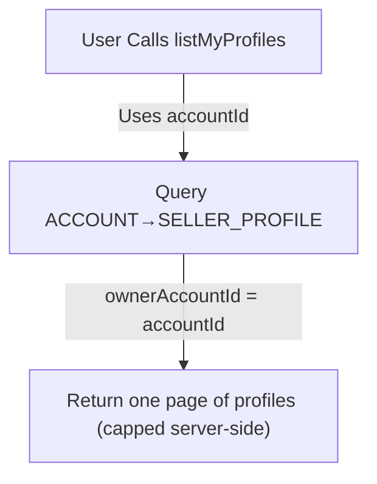
```mermaid
flowchart TD
    A["User Calls listMyProfiles"] -->|Uses accountId| B["Query ACCOUNT→SELLER_PROFILE"]
    B -->|ownerAccountId = accountId| C["Return one page of profiles (capped server-side)"]
```

### Get Campaign with Orders
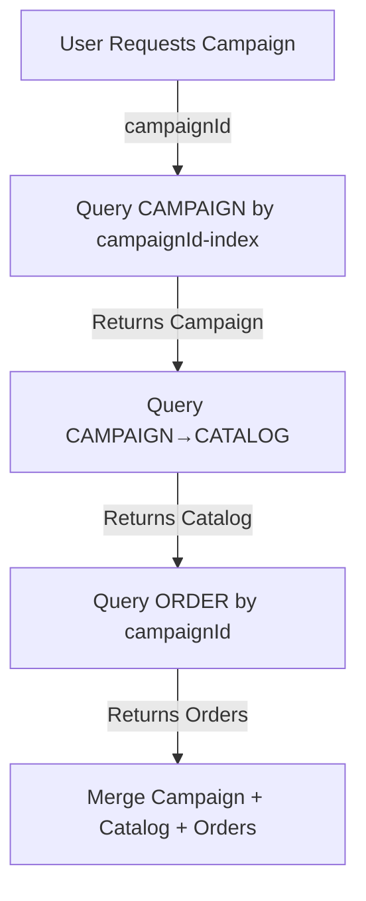
```mermaid
flowchart TD
    A["User Requests Campaign"] -->|campaignId| B["Query CAMPAIGN by campaignId-index"]
    B -->|Returns Campaign| C["Query CAMPAIGN→CATALOG"]
    C -->|Returns Catalog| D["Query ORDER by campaignId"]
    D -->|Returns Orders| E["Merge Campaign + Catalog + Orders"]
```

### Check Profile Access
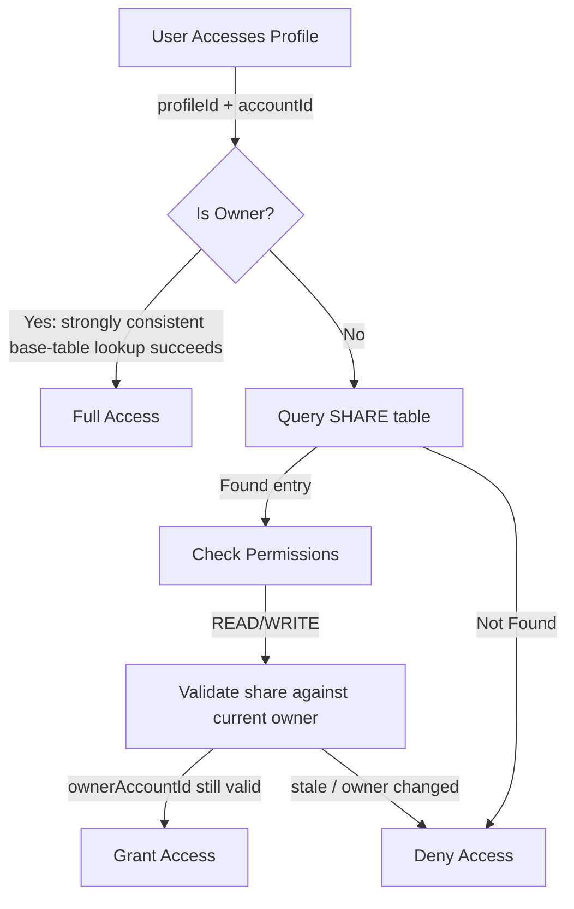
```mermaid
flowchart TD
    A["User Accesses Profile"] -->|profileId + accountId| B{Is Owner?}
    B -->|Yes: strongly consistent base-table lookup succeeds| C["Full Access"]
    B -->|No| D["Query SHARE table"]
    D -->|Found entry| E["Check Permissions"]
    E -->|READ/WRITE| F["Validate share against current owner"]
    F -->|ownerAccountId still valid| G["Grant Access"]
    F -->|stale / owner changed| H["Deny Access"]
    D -->|Not Found| H["Deny Access"]
```

### Find Unit's Campaign
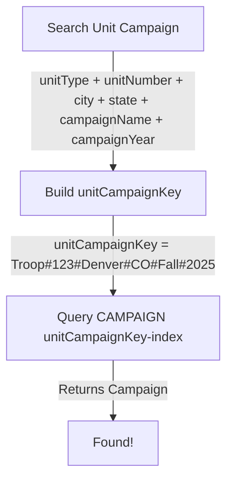
```mermaid
flowchart TD
    A["Search Unit Campaign"] -->|unitType + unitNumber + city + state + campaignName + campaignYear| B["Build unitCampaignKey"]
    B -->|unitCampaignKey = Troop#123#Denver#CO#Fall#2025| C["Query CAMPAIGN unitCampaignKey-index"]
    C -->|Returns Campaign| D["Found!"]
```

## Data Flow: Create Campaign from Shared Template

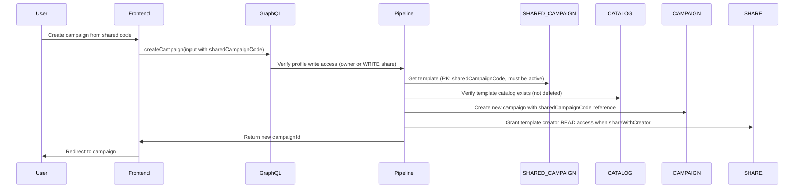
```mermaid
sequenceDiagram
    User->>Frontend: Create campaign from shared code
    Frontend->>GraphQL: createCampaign(input with sharedCampaignCode)
    GraphQL->>Pipeline: Verify profile write access (owner or WRITE share)
    Pipeline->>SHARED_CAMPAIGN: Get template (PK: sharedCampaignCode, must be active)
    Pipeline->>CATALOG: Verify template catalog exists (not deleted)
    Pipeline->>CAMPAIGN: Create new campaign with sharedCampaignCode reference
    Pipeline->>SHARE: Grant template creator READ access when shareWithCreator
    Pipeline->>Frontend: Return new campaignId
    Frontend->>User: Redirect to campaign
```

## Data Flow: Share Profile with Invite Code

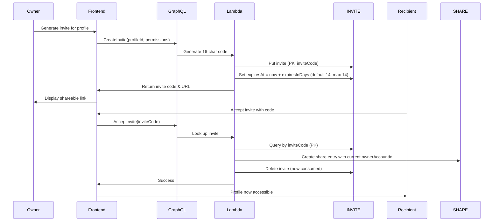
```mermaid
sequenceDiagram
    Owner->>Frontend: Generate invite for profile
    Frontend->>GraphQL: CreateInvite(profileId, permissions)
    GraphQL->>Lambda: Generate 16-char code
    Lambda->>INVITE: Put invite (PK: inviteCode)
    Lambda->>INVITE: Set expiresAt = now + expiresInDays (default 14, max 14)
    Lambda->>Frontend: Return invite code & URL
    Frontend->>Owner: Display shareable link
    
    Recipient->>Frontend: Accept invite with code
    Frontend->>GraphQL: AcceptInvite(inviteCode)
    GraphQL->>Lambda: Look up invite
    Lambda->>INVITE: Query by inviteCode (PK)
    Lambda->>SHARE: Create share entry with current ownerAccountId
    Lambda->>INVITE: Delete invite (now consumed)
    Lambda->>Frontend: Success
    Frontend->>Recipient: Profile now accessible
```

## Campaign Totals

`Campaign.totalOrders` and `Campaign.totalRevenue` are computed on demand from the `ORDER` table.

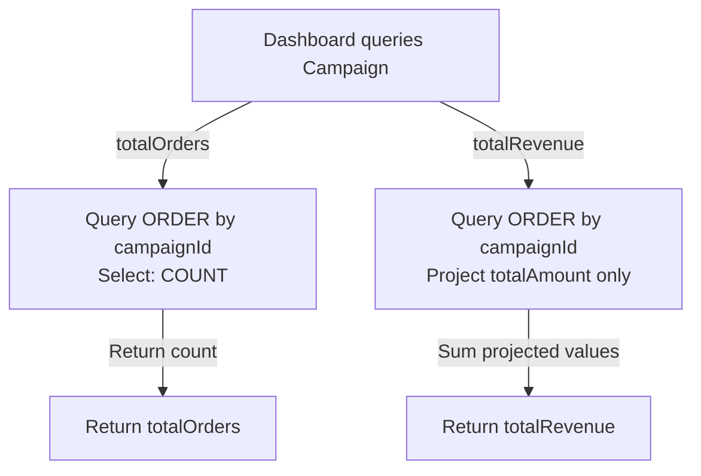
```mermaid
flowchart TD
    A["Dashboard queries Campaign"] -->|totalOrders| B["Query ORDER by campaignId<br/>Select: COUNT"]
    A -->|totalRevenue| C["Query ORDER by campaignId<br/>Project totalAmount only"]
    C -->|Sum projected values| D["Return totalRevenue"]
    B -->|Return count| E["Return totalOrders"]
```

## Index Strategy

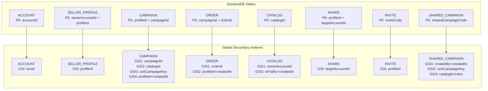
```mermaid
graph TD
    subgraph "DynamoDB Tables"
        A["ACCOUNT<br/>PK: accountId"]
        B["SELLER_PROFILE<br/>PK: ownerAccountId + profileId"]
        C["CAMPAIGN<br/>PK: profileId + campaignId"]
        D["ORDER<br/>PK: campaignId + orderId"]
        E["CATALOG<br/>PK: catalogId"]
        F["SHARE<br/>PK: profileId + targetAccountId"]
        G["INVITE<br/>PK: inviteCode"]
        H["SHARED_CAMPAIGN<br/>PK: sharedCampaignCode"]
    end
    
    subgraph "Global Secondary Indexes"
        A1["ACCOUNT<br/>GSI: email"]
        B1["SELLER_PROFILE<br/>GSI: profileId"]
        C1["CAMPAIGN<br/>GSI1: campaignId<br/>GSI2: catalogId<br/>GSI3: unitCampaignKey<br/>GSI4: profileId+createdAt"]
        D1["ORDER<br/>GSI1: orderId<br/>GSI2: profileId+createdAt"]
        E1["CATALOG<br/>GSI1: ownerAccountId<br/>GSI2: isPublic+createdAt"]
        F1["SHARE<br/>GSI: targetAccountId"]
        G1["INVITE<br/>GSI: profileId"]
        H1["SHARED_CAMPAIGN<br/>GSI1: createdBy+createdAt<br/>GSI2: unitCampaignKey<br/>GSI3: catalogId-index"]
    end
    
    A --> A1
    B --> B1
    C --> C1
    D --> D1
    E --> E1
    F --> F1
    G --> G1
    H --> H1
```

## Permission Model

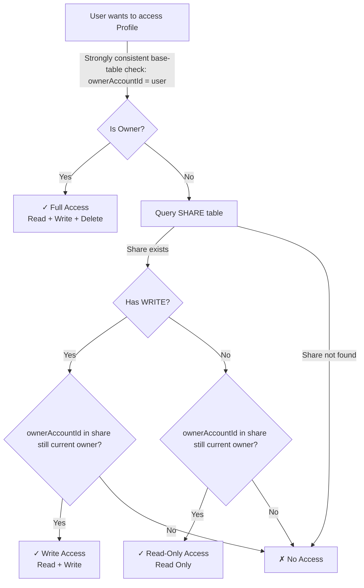
```mermaid
graph TD
    A["User wants to access Profile"] -->|Strongly consistent base-table check: ownerAccountId = user| B{Is Owner?}
    B -->|Yes| C["✓ Full Access<br/>Read + Write + Delete"]
    B -->|No| D["Query SHARE table"]
    D -->|Share exists| E{Has WRITE?}
    D -->|Share not found| F["✗ No Access"]
    E -->|Yes| G{"ownerAccountId in share still current owner?"}
    E -->|No| H{"ownerAccountId in share still current owner?"}
    G -->|Yes| I["✓ Write Access<br/>Read + Write"]
    G -->|No| F
    H -->|Yes| J["✓ Read-Only Access<br/>Read Only"]
    H -->|No| F
```

## State Management

### Active vs Inactive Campaigns
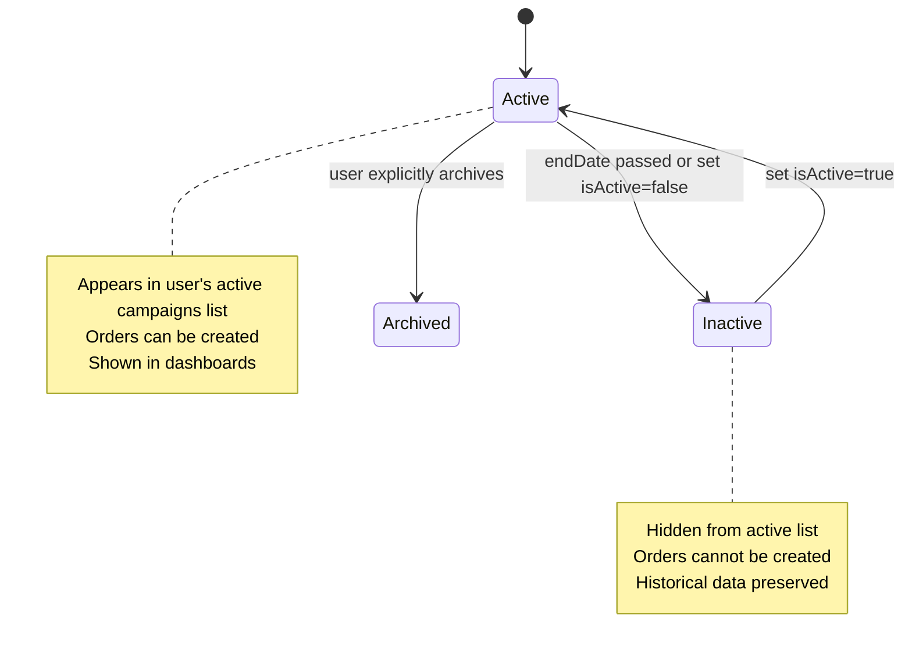
```mermaid
stateDiagram-v2
    [*] --> Active
    Active --> Inactive: endDate passed or set isActive=false
    Inactive --> Active: set isActive=true
    Active --> Archived: user explicitly archives
    
    note right of Active
        Appears in user's active campaigns list
        Orders can be created
        Shown in dashboards
    end note
    
    note right of Inactive
        Hidden from active list
        Orders cannot be created
        Historical data preserved
    end note
```

## Lifecycle: Order to Revenue

```mermaid
graph LR
    A["Customer places Order<br/>totalAmount = value"] -->|Stored in| B["ORDER table"]
    B -->|totalOrders| C["Dashboard queries ORDER<br/>Select: COUNT"]
    B -->|totalRevenue| D["Dashboard queries ORDER<br/>Project totalAmount"]
    A -->|Order contains| E["Line items array"]
    E -->|Product<br/>quantity"] F["Inventory tracking<br/>for reporting"]
```

## TTL: Invite Expiration

```mermaid
flowchart TD
    A["Invite created"] -->|expiresAt = now + N days (default 14, max 14)| B["TTL enabled"]
    B -->|After expiry| C["DynamoDB auto-deletes"]
    C -->|No manual cleanup needed| D["Cost efficient"]
    
    E["Invite accepted"] -->|Before expiration| F["User accepts invite<br/>Create SHARE entry"]
    F -->|Delete INVITE manually| G["Consumed, no TTL wait"]
```

## API Authentication Modes

The AppSync API (`tofu/application/modules/appsync/api.tf`) runs two authentication modes:

| Mode | Role | Who uses it |
|------|------|-------------|
| `AMAZON_COGNITO_USER_POOLS` | **Primary**, `default_action = ALLOW` | The signed-in app. Unmarked fields and types are reachable only through this mode. |
| `API_KEY` | **Additional** (`additional_authentication_provider`) | The public order pages. `x-api-key` from `VITE_APPSYNC_API_KEY`; the CloudFront `/graphql` behavior forwards it because it uses the managed `Managed-AllViewerExceptHostHeader` origin-request policy. |

The key is a separate `aws_appsync_api_key` resource with an **explicit `expires`** (the provider defaults to 7 days; AWS caps a key at 365 days and requires the timestamp rounded down to the hour). It is a transport credential, not a secret - the per-profile share token in the URL is the authorization. The value flows out as the `appsync_api_key` tofu output to `VITE_APPSYNC_API_KEY` (deploy build env, `frontend/.env.example`) and `TEST_APPSYNC_API_KEY` (`.env.example`, `scripts/generate_integration_env.py`, both export blocks of `scripts/ephemeral-env.sh`). On this branch no frontend source reads `VITE_APPSYNC_API_KEY`, so a build does NOT contain the key: the public buyer and receipt pages that will send `x-api-key` land in the pages slice and pick the variable up from the build environment automatically. The Vite path itself is proven - a variable that is referenced by the source (such as `VITE_APPSYNC_ENDPOINT`) bakes into `dist/` - but there is no reference point for the key until those pages land.

## Public Order Surface

Anonymous order placement (`publicGetOrderOffer`, `publicCreateOrder`, `publicGetOrderReceipt`) is exposed through six `@aws_api_key` object types - `PublicOrderOffer`, `PublicProduct`, `PublicPaymentMethod`, `PublicLineItem`, `PublicOrderReceipt`, `PublicOrderReceiptLookup` - plus `PublicCreateOrderInput` and the `OrderSource` / `OrderStatus` enums. Dedicated public types exist because `Catalog`/`Product` carry `@aws_cognito_user_pools` and `LineItem` carries nothing, and an API-key caller can only receive types that carry `@aws_api_key` themselves.

The owner-side settings pair (`getProfilePublicOrderSettings` / `updateProfilePublicOrderSettings`, returning `PublicOrderSettings`) carries an explicit `@aws_cognito_user_pools` directive and is never reachable with the API key. The settings travel as a `publicOrders` blob on the **profiles** item; the lifetime `publicOrderCount` counter lives on the **campaigns** item and is created only by the public write path (a later slice - `update_campaign_fn.js` builds its SET/REMOVE lists from named input fields only, so an ordinary campaign edit can never clobber it, pinned in `update_campaign_fn.test.js`). Neither name is exposed on `Profile`, `SellerProfile`, `SharedProfile`, `Order`, or any report type.

Both settings fields are bound to JS pipelines. Each reuses the two-phase write-access pair (#438) and then a `verify_public_settings_owner` gate that refuses everyone but the profile owner - a WRITE-share collaborator included - with `FORBIDDEN`. The gate emits that code itself because the pair's Query silent-deny branch (#547) leaves a null stash for a stranger and a nonexistent profile alike, so the settings read is not a profile-existence oracle. The read adds one CampaignsDS GetItem for `publicOrderCount`, `campaignName`, and the `campaignState` staleness flag (`OK` / `MISSING` / `INACTIVE`); a profile that never enabled the feature answers `enabled: false` with nulls rather than an error. The write validates the anchor campaign (exists, belongs to this profile, active - `isActive` absent means active, the pre-attribute back-compat) and then its catalog (exists, not soft-deleted) before a conditioned UpdateItem. The share token is minted by `util.autoId()` on first enable only, guarded by `attribute_not_exists(publicOrders.token)` so a concurrent first-enable fails with `CONFLICT` instead of overwriting the winner's URL; `rotateToken` replaces it (allowed while disabled), and disabling keeps it so the share URL stays stable. Omitted `campaignId` / `allowedPaymentMethods` keep the stored values while an explicit `null` is `INVALID_INPUT` (the #506 `Object.hasOwn` distinction). There is deliberately no optimistic lock against concurrent owner edits - the surface is owner-only.

The `Order` type carries the public-order attributes: `customerEmail`, `customerFirstName`, `customerLastName`, `orderSource`, and **nullable** `status`. Existing rows have none of them and are never backfilled, which is exactly why `status` is nullable - a non-null copy would fail every legacy row read. `receiptToken` is deliberately not an `Order` field (it is a per-order capability carried only in the buyer's email link), and `status` is not in `UpdateOrderInput`: the seller-side transition lands with the order lifecycle slice, so no input accepts a value nothing honors yet.

The offer read (`publicGetOrderOffer`) is a direct UNIT resolver on the `public-orders` Lambda (`lambda_unit_resolver.js`), not a pipeline: it needs five datastore reads (one profiles Query plus four GetItems) plus local QR signing, and one APPSYNC_JS function gets exactly one datastore call. It locates the profile through `profileId-index` (a locator only - a multi-projection left by a profile transfer is resolved with strongly consistent reads per candidate, and an ambiguous owner is `NOT_FOUND`), confirms the row with a consistent base-table GetItem, compares the URL token with `hmac.compare_digest`, then GetItems the anchor campaign by canonical id (never the `campaignId-index` GSI the authenticated path uses), its catalog, and the owner account's `preferences.paymentMethods`. Every negative branch - unknown profile, disabled, bad or missing token, missing/inactive anchor, missing/soft-deleted catalog, ambiguous projection - answers the identical `NOT_FOUND`, so probing cannot distinguish them; an empty product or method list is a successful offer, not an error. Allowed methods are the seller's allowlist intersected case-insensitively with the account's stored methods, with `Cash`/`Check` counting as existing but never force-added, and each QR key is pre-signed with the stored key passed explicitly (the helper's no-key path probes slug-shaped keys that can never match the stored UUID keys). The handler's role grants no orders access and its `s3:GetObject` grant on `payment-qr-codes/*` exists only because S3 authorizes the buyer's pre-signed GET against the signing role at request time.

Still landing in later slices: the `publicCreateOrder` / `publicGetOrderReceipt` resolvers (the second and third public fields still have no resolver binding), the campaign-delete auto-disable step, the pages, and the email path. Pinned by `tests/unit/test_public_api_key_surface.py` (`.tf` half) and `tests/unit/check_public_api_key_surface.test.ts` (schema-directive half).

## References

- **GraphQL Schema**: [tofu/application/schema/schema.graphql](../tofu/application/schema/schema.graphql)
- **DynamoDB Infrastructure**: [tofu/application/modules/dynamodb/main.tf](../tofu/application/modules/dynamodb/main.tf)
- **Authorization Rules**: [AGENTS.md](../AGENTS.md#appsync-resolver-only-authorization-posture-71)
- **Developer Guide**: [DEVELOPER_GUIDE.md](DEVELOPER_GUIDE.md)
