# Data Schema - Popcorn Sales Manager

Visual schema documentation for the DynamoDB data model.

## Tables Overview

```mermaid
graph LR
    A["📋 ACCOUNTS<br/>PK: accountId<br/>GSI: email"] 
    B["👤 PROFILES<br/>PK: ownerAccountId + profileId<br/>GSI: profileId"]
    C["📊 CAMPAIGNS<br/>PK: profileId + campaignId<br/>GSI: campaignId, catalogId, unitCampaignKey, profileId+createdAt"]
    D["📦 ORDERS<br/>PK: campaignId + orderId<br/>GSI: orderId, profileId+createdAt"]
    E["🛍️ CATALOGS<br/>PK: catalogId<br/>GSI: ownerAccountId, isPublic+createdAt"]
    F["🔗 SHARES<br/>PK: profileId + targetAccountId<br/>GSI: targetAccountId"]
    G["🎫 INVITES<br/>PK: inviteCode<br/>GSI: profileId<br/>TTL: expiresAt"]
    H["🔄 SHARED_CAMPAIGNS<br/>PK: sharedCampaignCode<br/>GSI: createdBy+createdAt, unitCampaignKey"]
    
    B -->|created by| A
    C -->|in| B
    D -->|in| C
    C -->|uses| E
    F -->|grants access to| B
    G -->|for| B
    H -->|creates| C
    E -->|created by| A
```



## Table Details

### accounts
Primary Key: `accountId` (String)
Global Secondary Indexes: `email-index` (email)

| Attribute | Type | Purpose |
|-----------|------|---------|
| accountId | String | PK - Cognito user sub |
| email | String | GSI - User lookup by email |
| givenName | String | User's first name |
| familyName | String | User's last name |
| city | String | Location |
| state | String | Location |
| unitType | String | Scout unit type |
| unitNumber | Integer | Scout unit number |
| isAdmin | Boolean | Admin flag |
| preferences | JSON | User settings |
| createdAt | DateTime | Timestamp |
| updatedAt | DateTime | Timestamp |

### profiles
Primary Key: `ownerAccountId` + `profileId` (Composite)
Global Secondary Indexes: `profileId-index` (profileId)

| Attribute | Type | Purpose |
|-----------|------|---------|
| ownerAccountId | String | PK - Account owner |
| profileId | String | SK - Profile ID, also in GSI |
| sellerName | String | Scout/seller name |
| createdAt | DateTime | Timestamp |
| updatedAt | DateTime | Timestamp |

### campaigns
Primary Key: `profileId` + `campaignId` (Composite)
Global Secondary Indexes: 
- `campaignId-index` (campaignId)
- `catalogId-index` (catalogId)
- `unitCampaignKey-index` (unitCampaignKey)
- `profileId-createdAt-index` (profileId + createdAt)

| Attribute | Type | Purpose |
|-----------|------|---------|
| profileId | String | PK - Profile owner |
| campaignId | String | SK - Campaign ID, also in GSI |
| campaignName | String | Campaign display name |
| campaignYear | Integer | Sales year |
| startDate | DateTime | Optional start date |
| endDate | DateTime | Optional end date |
| catalogId | String | GSI - Which catalog used |
| unitType | String | Scout unit type |
| unitNumber | Integer | Scout unit number |
| city | String | Unit location |
| state | String | Unit location |
| sharedCampaignCode | String | Reference to shared template |
| isActive | Boolean | Active/inactive flag |
| totalOrders | Integer | Denormalized count |
| totalRevenue | Float | Denormalized sum |
| unitCampaignKey | String | GSI - Composite lookup key |
| createdAt | DateTime | GSI - Sorting |
| updatedAt | DateTime | Timestamp |

### orders
Primary Key: `campaignId` + `orderId` (Composite)
Global Secondary Indexes:
- `orderId-index` (orderId)
- `profileId-index` (profileId + createdAt)

| Attribute | Type | Purpose |
|-----------|------|---------|
| campaignId | String | PK - Campaign |
| orderId | String | SK - Order ID, also in GSI |
| profileId | String | GSI - For cross-campaign queries |
| customerName | String | Customer name |
| customerEmail | String | Customer email |
| customerPhone | String | Customer phone |
| items | JSON | Line items array |
| totalAmount | Float | Order total |
| paymentMethod | String | Payment type |
| deliveryStatus | String | Delivery state |
| notes | String | Order notes |
| createdAt | DateTime | GSI - Sorting |
| updatedAt | DateTime | Timestamp |

### catalogs
Primary Key: `catalogId` (String)
Global Secondary Indexes:
- `ownerAccountId-index` (ownerAccountId)
- `isPublic-createdAt-index` (isPublicStr + createdAt)

| Attribute | Type | Purpose |
|-----------|------|---------|
| catalogId | String | PK - Catalog ID |
| catalogName | String | Catalog name |
| products | JSON | Product definitions |
| ownerAccountId | String | GSI - User's catalogs |
| catalogType | String | ADMIN_MANAGED or USER_CREATED |
| isPublic | Boolean | Visibility flag |
| isPublicStr | String | String version for GSI |
| isDeleted | Boolean | Soft-delete flag |
| createdAt | DateTime | GSI - Sorting |
| updatedAt | DateTime | Timestamp |

### shares
Primary Key: `profileId` + `targetAccountId` (Composite)
Global Secondary Indexes: `targetAccountId-index` (targetAccountId)

| Attribute | Type | Purpose |
|-----------|------|---------|
| profileId | String | PK - Shared profile |
| targetAccountId | String | SK - Recipient account, also in GSI |
| permissions | StringSet | READ, WRITE |
| createdAt | DateTime | Timestamp |
| updatedAt | DateTime | Timestamp |

### invites
Primary Key: `inviteCode` (String)
Global Secondary Indexes: `profileId-index` (profileId)
TTL: `expiresAt` (14 days)

| Attribute | Type | Purpose |
|-----------|------|---------|
| inviteCode | String | PK - 8-char code |
| profileId | String | GSI - Profile being invited to |
| permissions | StringSet | READ, WRITE permissions |
| expiresAt | DateTime | TTL - Auto-delete after 14 days |
| createdAt | DateTime | Timestamp |

### shared_campaigns
Primary Key: `sharedCampaignCode` (String)
Global Secondary Indexes:
- `GSI1` (createdBy + createdAt)
- `GSI2` (unitCampaignKey)

| Attribute | Type | Purpose |
|-----------|------|---------|
| sharedCampaignCode | String | PK - Shareable template code |
| campaignName | String | Template name |
| catalogId | String | Catalog reference |
| unitType | String | Target unit type |
| unitNumber | Integer | Target unit number (0 = any) |
| city | String | Unit location |
| state | String | Unit location |
| campaignYear | Integer | Sales year |
| createdBy | String | GSI1 - Creator account |
| createdAt | DateTime | GSI1 - Sorting, GSI2 lookup |
| isActive | Boolean | Active/inactive |
| description | String | Template description |
| unitCampaignKey | String | GSI2 - Unit lookup |

## Query Flows

### Get User's Profiles

```mermaid
flowchart TD
    A["User Calls getMyProfiles"] -->|Uses accountId| B["Query ACCOUNT→SELLER_PROFILE"]
    B -->|ownerAccountId = accountId| C["Return all profiles"]
```


### Get Campaign with Orders

```mermaid
flowchart TD
    A["User Requests Campaign"] -->|campaignId| B["Query CAMPAIGN by campaignId-index"]
    B -->|Returns Campaign| C["Query CAMPAIGN→CATALOG"]
    C -->|Returns Catalog| D["Query ORDER by campaignId"]
    D -->|Returns Orders| E["Merge Campaign + Catalog + Orders"]
```


### Check Profile Access


### Find Unit's Campaign


## Data Flow: Create Campaign from Shared Template


## Data Flow: Share Profile with Invite Code


## Denormalization & Caching


## Index Strategy


## Permission Model


## State Management

### Active vs Inactive Campaigns


## Lifecycle: Order to Revenue

```mermaid
graph LR
    A["Customer places Order<br/>totalAmount = value"] -->|Triggers| B["Update CAMPAIGN<br/>totalOrders++<br/>totalRevenue += amount"]
    B -->|Denormalized data| C["Dashboard loads instantly<br/>No ORDER table scans"]
    A -->|Order contains| D["Line items array"]
    D -->|Product<br/>quantity"] E["Inventory tracking<br/>for reporting"]
```

## TTL: Invite Expiration


## References

- **GraphQL Schema**: [tofu/schema/schema.graphql](../tofu/schema/schema.graphql)
- **DynamoDB Infrastructure**: [tofu/modules/dynamodb/main.tf](../tofu/modules/dynamodb/main.tf)
- **Authorization Rules**: [AGENT.md](AGENT.md#authorization-pattern)
- **Developer Guide**: [DEVELOPER_GUIDE.md](DEVELOPER_GUIDE.md)
